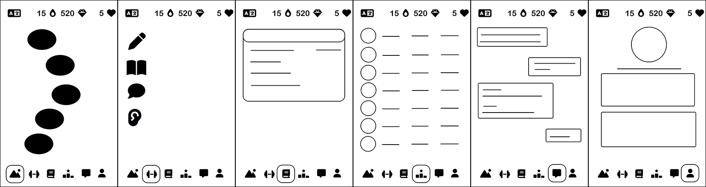
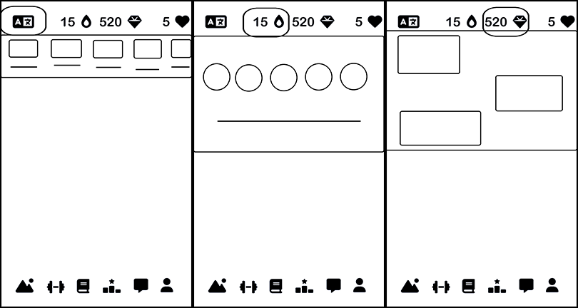

# Whitepaper : ChronoLingo

## **Table of Contents**

1. Introduction
2. Overall Game Features and UI/UX
   - Game Features
   - UI/UX Design
3. Requirements Overview
   - Functional Requirements
   - Non-Functional Requirements
4. App Structure
   - Client-Side Architecture
   - Server-Side Architecture
   - Database Design
   - Language Models
5. Technologies Used and Feasibility
6. Development Plan
   - Milestones and Tasks
7. Additional Considerations
   - Security Measures
   - Scalability
   - Accessibility
   - Legal and Ethical Considerations
8. Conclusion

---

## **1. Introduction**

This whitepaper outlines a comprehensive plan to develop a language learning puzzle app inspired by DuoLingo, using .NET MAUI. The app focuses on providing engaging and interactive learning experiences for users interested in English-Dutch and English-Portuguese language pairs, with the possibility of adding more languages in the future. By leveraging client-side processing and a variety of game modes, the app aims to deliver efficient learning while maintaining a light server load.

---

## **2. Overall Game Features and UI/UX**

### **2.1 Game Features**

#### **Language Pairs**

- **Current**
  - English-Dutch
  - English-Portuguese
- **Future Expansion**
  - Ability to add more language pairs easily through modular design

#### **Puzzle Types**

- **Sorting**
  - Sorting all blocks
  - Sorting some blocks
- **Completing**
  - **Picking from Options**
    - Two audio options
    - Three word options
  - **Typing**
    - Part of the sentence
    - Full translation
  - **Speaking**
    - Part of the sentence
    - Full translation
- **Matching**
  - Image to Word
  - Audio to Word
  - Word to Word
  - Speaking to Word

#### **Game Modes**

- **Learning Path**
  - Vocabulary
  - Regular
  - Story
  - Finals
  - Golden
  - Quick Combining
- **Exercise**
  - Listening
  - Vocabulary
  - Grammar
  - Speaking
- **Messaging**
  - Chat with friends:
    - Type in native language, receive in target language
    - Type in target language, receive in native language
  - Send hearts and gems (with security and privacy measures)

#### **Main Characters**

| Character | Age | Sex | Description               | Background Story                                          |
|-----------|-----|-----|---------------------------|-----------------------------------------------------------|
| Cat       | 3   | N/A | Playful and mischievous   | Loves napping on clothes and is a picky foodie            |
| Alex      | 7   | M   | Friendly and encouraging  | Loves playing with friends                                |
| Emma      | 13  | F   | Energetic and cheerful    | Enjoys reading and wants to become a scientist            |
| Leo       | 19  | M   | Creative and ambitious    | Passionate about technology and space travel              |
| Mia       | 29  | F   | Confident and supportive  | Enjoys traveling and owns a business; mother to Emma      |
| Sam       | 37  | M   | Calm and instructive      | Former teacher; loves gardening; father to Alex           |
| Zoe       | 89  | F   | Creative and artistic     | Grandmother to Alex and Emma; loves storytelling          |
| Victor    | 97  | M   | Wise and calm             | Great-grandfather to Alex and Emma; loves history         |

#### **User Profile**

- **Stats**
  - XP
  - Gems
  - Hearts
  - Streak count
- **Achievements**
  - Badges and milestones
- **Friends**
  - Friend list
  - Connect via username search
- **Settings**
  - Language preferences
  - Accessibility options
  - Privacy settings

#### **Rewards System**

- **Experience Points (XP)**
  - Earned through completing lessons and exercises
- **Gems**
  - Earned by hitting milestones or completing non-learning path exercises
  - Used to purchase items in the shop
- **Hearts**
  - Represent attempts in learning path; replenish over time
  - Can be gifted to friends or purchased with gems
- **Shop System**
  - Purchase streak-freeze, hearts, and cosmetic items
  - Customize avatars and unlock special features
- **Streak Count**
  - Encourages daily engagement
  - Streak-freeze available to prevent losing progress

### **2.2 UI/UX Design**

#### **Intuitive Interface**

- **Top Navigation Bar**
  - Language selection
  - Streak count
  - Gems count with access to the shop
  - Hearts count with refill options
- **Bottom Navigation Bar**
  - **Learning Path** Access to main lessons
  - **Exercise** Quick practices and drills
  - **Grammar** Detailed explanations and tips
  - **Messages** Chat with friends
  - **Ranking** Weekly leaderboards among friends
  - **Profile** User stats and settings

#### **Interactive Elements**

- Animated characters providing real-time feedback
- Visual cues (colors, icons) for correct and incorrect answers
- Smooth transitions and engaging animations

#### **Accessibility**

- Adjustable font sizes and color themes
- Support for dyslexic-friendly fonts
- VoiceOver and TalkBack support for visually impaired users
- High-contrast mode and customizable interface

#### **Engagement Features**

- Daily challenges and reminders
- Progress bars showing lesson completion
- Achievement badges and unlockable content
- Leaderboards and social sharing options

---

## **2.3 UI Previews**

## **3. Requirements Overview**

### **3.1 Functional Requirements**

#### **User Authentication**

- Secure registration and login
- Password recovery options
- Support for third-party authentication (e.g., Google, Facebook) in future updates

#### **Language Learning Features**

- Modular language packs for English-Dutch and English-Portuguese
- Variety of puzzle types: Sorting, Completing, Matching
- Game modes: Learning Path, Exercise, Messaging
- Offline access to downloaded language packs

#### **Speech Processing**

- **Client-Side Text-to-Speech (TTS)**
  - Utilize platform-specific TTS APIs for voice rendering
- **Client-Side Speech-to-Text (STT)**
  - Use built-in speech recognition services for input validation
- **Performance Optimization**
  - Efficient processing to minimize battery usage and lag

#### **Social Features**

- Friend search and connection
- Friend leaderboards and progress tracking
- Secure messaging with end-to-end encryption
- Ability to send hearts and gems to friends

#### **Rewards and Progression**

- Tracking of XP, gems, hearts, and streaks
- Achievement system with badges and milestones
- Shop system for purchasing items with gems
- Customizable avatars and unlockable character animations

### **3.2 Non-Functional Requirements**

#### **Performance**

- Fast loading times and responsive UI
- Smooth animations and transitions
- Optimized for low memory and battery usage

#### **Security**

- Data encryption for sensitive information
- Secure API endpoints with token-based authentication (e.g., JWT)
- Compliance with data protection regulations (e.g., GDPR, CCPA)
- Regular security audits and updates

#### **Scalability**

- Modular architecture to support adding new languages and features
- Cloud-based backend with auto-scaling capabilities
- Efficient database design for performance under high user loads

#### **Maintainability**

- Clean, modular codebase following best practices
- Comprehensive documentation and code comments
- Automated testing and CI/CD pipelines

#### **Accessibility**

- Compliance with WCAG 2.1 standards
- Regular accessibility testing and user feedback incorporation

#### **Legal and Ethical Considerations**

- Clear Terms of Service and Privacy Policy
- User consent for data collection and processing
- Licensing for all content, images, and audio files

---

## **4. App Structure**

### **4.1 Client-Side Architecture**

#### **Presentation Layer**

- Built with **.NET MAUI** using **XAML** and **C#**
- Implements the **MVVM (Model-View-ViewModel)** pattern
- Reusable UI components and styles for consistency

#### **Business Logic Layer**

- Handles game mechanics and state management
- Manages user interactions and input validation
- Implements localization and internationalization support

#### **Data Layer**

- Uses **SQLite** for local data storage (language packs, user progress)
- Synchronizes data with the server using background services
- Caching mechanisms to improve performance

### **4.2 Server-Side Architecture**

#### **API Layer**

- Developed using **ASP.NET Core Web API**
- RESTful endpoints for authentication, user data, and social features
- Implements token-based authentication (e.g., JWT)

#### **Database Layer**

- Uses **Entity Framework Core** for ORM
- **Database Management System (DBMS)** Azure SQL Database or AWS RDS
- Data access layer with repository patterns for maintainability

### **4.3 Database Design**

#### **Tables and Relationships**

**Users**

- `UserId` (Primary Key)
- `Username`
- `Email`
- `PasswordHash`
- `Salt` (for password hashing)
- `XP`
- `Gems`
- `Hearts`
- `StreakCount`
- `PreferredLanguagePair`
- `ProfilePicture`
- `Settings` (JSON object for user preferences)
- **Relationships**
  - One-to-Many with **Progress**
  - One-to-Many with **UserAchievements**
  - Many-to-Many with **Users** (through **Friends**)

**Friends**

- `UserId` (Foreign Key to Users)
- `FriendId` (Foreign Key to Users)
- `Status` (Pending, Accepted)

**Progress**

- `ProgressId` (Primary Key)
- `UserId` (Foreign Key to Users)
- `LessonId`
- `Score`
- `CompletionDate`

**ShopItems**

- `ItemId` (Primary Key)
- `ItemName`
- `Cost`
- `Description`
- `ItemType` (e.g., Heart, Streak-Freeze, Avatar Item)

**Messages**

- `MessageId` (Primary Key)
- `SenderId` (Foreign Key to Users)
- `ReceiverId` (Foreign Key to Users)
- `Content` (Encrypted)
- `Timestamp`
- `IsRead`

**Achievements**

- `AchievementId` (Primary Key)
- `Name`
- `Description`
- `Icon`

**UserAchievements**

- `UserId` (Foreign Key to Users)
- `AchievementId` (Foreign Key to Achievements)
- `DateUnlocked`

**LanguagePacks**

- `LanguagePackId` (Primary Key)
- `LanguagePair` (e.g., "English-Dutch")
- `Data` (Stored externally or as references)

### **4.4 Language Models**

#### **LanguagePack Class**

- Contains vocabulary, phrases, grammar rules
- Includes links to audio files and images
- Supports modular addition of new languages

#### **Puzzle Classes**

- **SortingPuzzle**
- **CompletingPuzzle**
- **MatchingPuzzle**

#### **GameMode Classes**

- **LearningPathGame**
- **ExerciseMode**
- **MessagingMode**

---

## **5. Technologies Used and Feasibility**

### **5.1 Technologies**

#### **Client-Side**

- **.NET MAUI** For cross-platform app development (iOS, Android, Windows, macOS)
- **C# and XAML** Primary languages for app logic and UI design
- **SQLite** Local data storage on the client-side
- **Platform-Specific TTS and STT APIs**
  - **iOS** AVFoundation for TTS, Speech framework for STT
  - **Android** Android.Speech.Tts for TTS, SpeechRecognizer for STT
- **Dependency Injection** For better code management and testing

#### **Server-Side**

- **ASP.NET Core Web API** Backend API development
- **Entity Framework Core** Database interactions
- **Azure/AWS Cloud Services** For hosting backend services
- **JWT (JSON Web Tokens)** For secure authentication

#### **Third-Party Services**

- **Analytics** Firebase Analytics or App Center for user behavior tracking
- **Push Notifications** Firebase Cloud Messaging or Azure Notification Hubs
- **Security Tools** OWASP ZAP for vulnerability scanning

### **5.2 Feasibility**

- **Client-Side Speech Processing**
  - Feasible with platform-specific APIs
  - Efficient performance on modern devices
- **Language Packs Storage**
  - Small file sizes allow for local storage
  - Option to download additional packs as needed
- **Cross-Platform Development**
  - .NET MAUI provides a unified framework
  - Shared codebase reduces development time
- **Security Measures**
  - Established frameworks offer robust security features
  - Regular updates and patches to maintain security

---

## **6. Development Plan**

### **Milestone 1: Project Initialization**
- Set up version control with GitHub Organization
- Initialize .NET MAUI project structure
- Establish coding standards and guidelines
- Design high-fidelity UI mockups for core screens
- Set up CI/CD pipelines for automated builds

### **Milestone 2: User Authentication and Profile**
- Implement registration and login screens
- Develop server-side authentication APIs with JWT
- Create user profile page displaying stats, achievements, and settings
- Implement password recovery and account verification

### **Milestone 3: Core Game Mechanics**
- Develop puzzle classes and core game logic
- Implement Sorting, Completing, and Matching puzzles
- Set up the MVVM architecture for data binding
- Create unit tests for game logic

### **Milestone 4: Language Packs Integration**
- Design LanguagePack class structure for modularity
- Load English-Dutch and English-Portuguese data
- Implement offline access and management of language packs
- Add support for future language additions

### **Milestone 5: Learning Path Game Mode**
- Develop Learning Path progression system with levels and checkpoints
- Implement Vocabulary and Regular puzzle types within the learning path
- Design UI for intuitive learning path navigation
- Include progress tracking and visual indicators

### **Milestone 6: Rewards and Shop System**
- Implement tracking for XP, gems, hearts, and streaks
- Develop shop UI and purchasing logic for items
- Set up server-side endpoints for secure transactions
- Integrate with payment gateways if necessary

### **Milestone 7: Speech Processing Integration**
- Integrate client-side TTS for voice rendering using platform APIs
- Implement STT for speech input puzzles
- Optimize performance and handle edge cases (e.g., accents, background noise)
- Ensure privacy by processing speech data locally

### **Milestone 8: Social Features**
- Implement friend search and connection functionality
- Develop leaderboards displaying friends' progress
- Implement secure messaging with encryption
- Create server-side logic for social interactions

### **Milestone 9: Characters and UI Enhancements**
- Design and animate characters, ensuring they enhance learning
- Enhance UI with responsive animations and feedback mechanisms
- Implement accessibility features and test for compliance
- Create a style guide for consistent UI elements

### **Milestone 10: Additional Features and Gamification**
- Implement daily challenges and adaptive difficulty
- Develop progress bars, achievement badges, and unlockable content
- Introduce social gamification elements (e.g., group challenges)
- Set up analytics to track feature engagement

### **Milestone 11: Testing and Optimization**
- Conduct unit, integration, and system testing throughout development
- Perform performance optimization and code refactoring
- Conduct security testing, including vulnerability assessments
- Prepare beta versions for early user feedback

### **Milestone 12: Deployment and Launch**
- Prepare app for deployment on iOS and Android app stores
- Set up cloud infrastructure with scalability in mind
- Finalize Terms of Service and Privacy Policy
- Launch marketing campaign and collect user feedback

---

## **7. Additional Considerations**

### **7.1 Security Measures**

- **Data Encryption**
  - Use HTTPS for all network communication
  - Encrypt sensitive data stored locally
- **Authentication Tokens**
  - Implement secure token storage (e.g., Keychain on iOS, Keystore on Android)
- **Regular Updates**
  - Keep all dependencies up-to-date to patch security vulnerabilities
- **User Privacy**
  - Obtain explicit consent for data collection
  - Provide options for users to delete their data

### **7.2 Scalability**

- **Modular Architecture**
  - Use microservices for backend components
  - Design the system to handle increased load gracefully
- **Cloud Infrastructure**
  - Utilize auto-scaling features of Azure or AWS
  - Implement load balancing and CDN services

### **7.3 Accessibility**

- **Comprehensive Testing**
  - Test with users who have disabilities
  - Include accessibility features in QA testing plans
- **User Customization**
  - Allow users to adjust interface settings to their needs
  - Provide alternative text for images and support for screen readers

### **7.4 Legal and Ethical Considerations**

- **Content Licensing**
  - Ensure all educational content is original or properly licensed
- **Compliance**
  - Stay updated on international laws regarding data protection
- **User Consent**
  - Transparent communication about how user data is used
- **Age Restrictions**
  - Implement age verification if necessary
  - Provide parental controls and consent for younger users

---

## **8. Conclusion**

This revised development plan incorporates strategic enhancements to strengthen the app's feasibility, user experience, security, and scalability. By focusing on modular design, robust security measures, accessibility, and user engagement, the app is positioned to deliver a high-quality learning experience. Adopting an Agile development approach with continuous testing and user feedback will ensure the app meets user needs and stands out in the competitive language learning market.

---

**Next Steps**

- Begin Milestone 1 with a focus on setting up a strong foundat
- Establish a project management tool (e.g., Jira, Trello) to track tasks.

---
